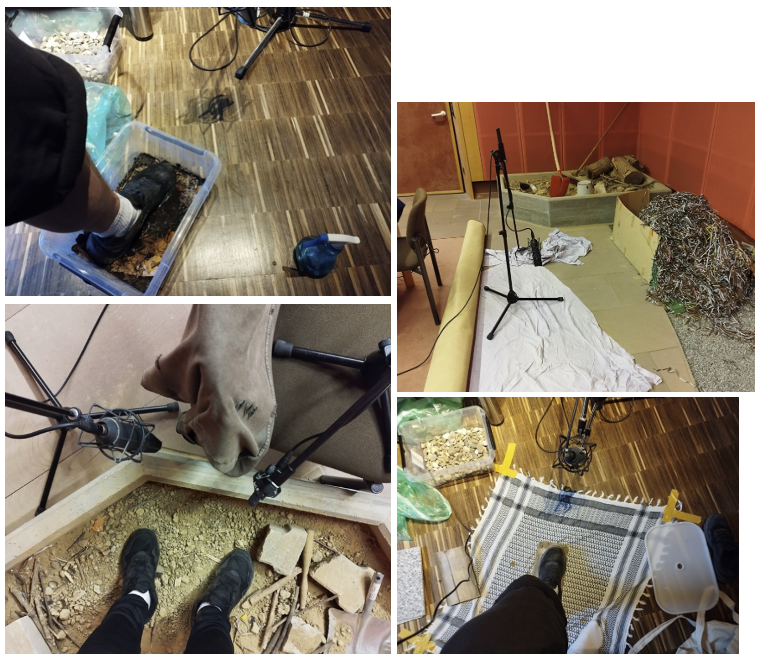

**Stepper** is a real-time VST3 footstep sampler made with HISE that is designed to simplify the creation of realistic walking sounds directly in your DAW. Instead of manually dragging and placing footsteps in the timeline, this plugin allows you to "perform" footsteps using MIDI input where one key represents one each foot.

It features **over 600 high-quality, self-recorded Foley samples**, captured in professional studio environments such as the SWR's Foley stage in Tübingen and the sound studio at Furtwangen University. The plugin includes 10 different surfaces (e.g., gravel, wood, wet earth, etc.) and offers three dynamic walking speeds (slow, medium, fast), which are automatically selected based on your playing tempo.

This tool is **ideal for anyone working on film, games, or other projects involving audio** who needs fast, expressive, and synchronized footstep sounds. **Stepper* is thought to be a quick alternative especially for creators without access to full Foley facilities.

This Plug-In is a work in progress and **new features** will be added in the near future including:
- The ability to switch between different shoe types 
- An option to toggle the automatic speed-based step changes on/off
- Support for switching between different microphone positions to enhance spatial sound realism
- Customizable MIDI key mapping so users can assign foot triggers according to their preferences

**Note:** The standalone app is just for trying out and won’t work with a MIDI keyboard (howerver after clicking any piano key with your mouse once, you can use it with the "A" and "S" keys of your keyboard). If you want to use Stepper to its **full potential**, please use the plug-in within the context of your DAW.

